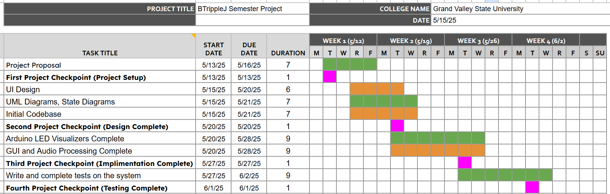

Team name: BTripleJ 

Team members: Blake, Joey, Josh, Jason

# Introduction
The goal is to create a Python script for analysing audio from either a microphone or computer input. The script will find the pitch of the audio played and send it to a microcontroller over a communication line, most likely UART. The microcontroller will then light up respective LED’s in response to the pitch and volume. There will be different options for the LED output, changing how the LEDs react to different frequencies.

# Feature List:
The general idea is to create an audio visualizer with two major components. There will be a Python-Tkinter based application that collects and processes audio from the computer or microphone. There will also be an arduino connected to the computer over USB and controlled by the python application. The arduino will control a physical LED strip or panel using the FastLED library.

In the python application there will be a Microphone mode, Computer Audio mode, and potentially a Synth Keyboard mode. The audio input will be able to be selected to change mode. There will be multiple audio visualization modes that can be selected. The application will allow you to select the USB device as in windows COM port numbers change around. This communicates to an Arduino that uses FastLed. 

Depending on time one possible extra feature is a Synth Keyboard mode. One of our members has previously created a python-based synth keyboard. This could be added to the gui as another mode depending on time constraints for the project.

# Anticipated Technologies

(What technologies are needed to build this project)

# Method/Approach

(What is your estimated "plan of attack" for developing this project)

# Estimated Timeline
The project will have 4 major milestones, one of which is already completed. We are using the Agile-Scrum Method.

[Link to Sheet](https://docs.google.com/spreadsheets/d/1eZ33CW3As2u8aA7Ld-r0fqiov71TXy7yKgWPYP40Ih0/edit?usp=sharing)

# Anticipated Problems

(Describe any problems you foresee that you will need to overcome)

Remember this is a living document is expected to be changed as you make progress on your project.
